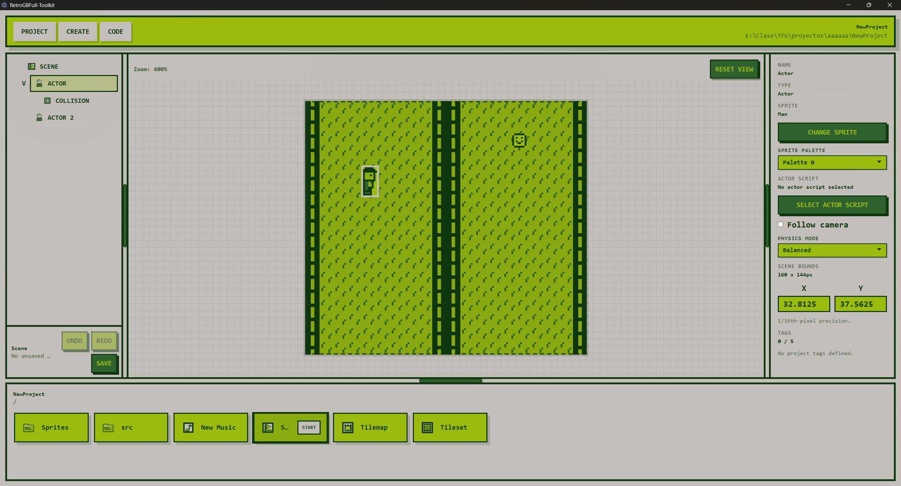
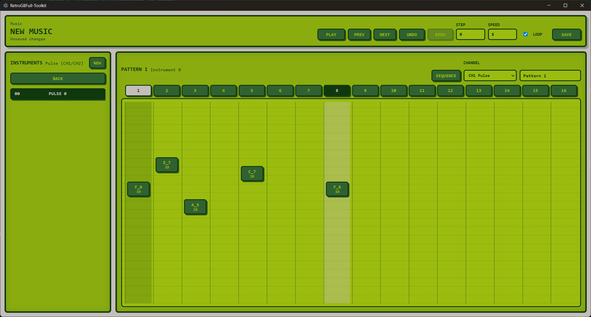
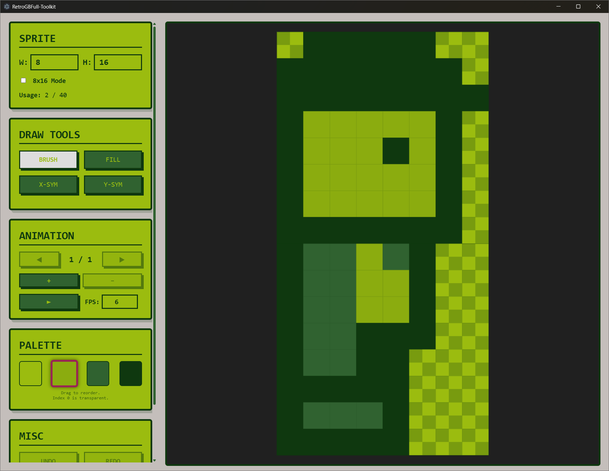
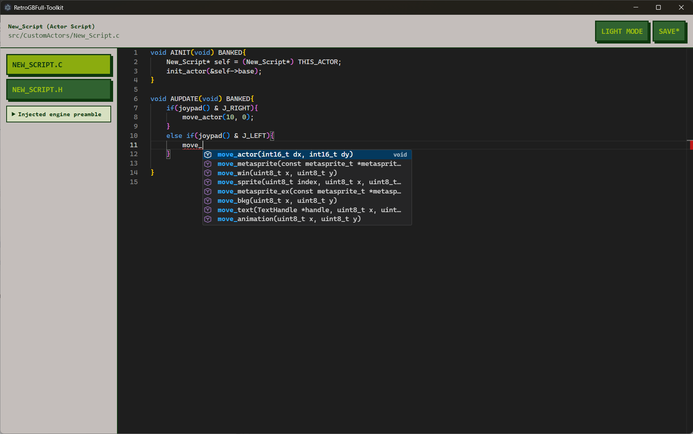
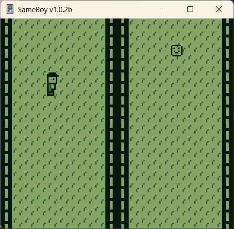

# RetroGBFull Toolkit

## What is RetroGBFull Toolkit

RetroGBFull Toolkit is a full game engine for the Game Boy. It intends to bridge the gap between code only solutions and visual first solutions.

To do this, it includes:
- A GUI from which you can make your game in its entirety. This includes asset creation, composing scenes and scripting.
- A custom engine core based on GBDK-2020 that allows you to write scripts in C that inject into the game's runtime and allow you to work over a wide abstraction layer or interacting directly with GBDK-2020 to give you as much freedom as possible.
 
 ## Features
- Asset editors: edit sprites, tilesets, tilemaps and music directly from the engine.
- Asset explorer: organize your game's assets in a file explorer style UI
- Scene editor: visually compose scenes, organize the scene hierarchy and edit node properties (including default values for some variables if a script is attached to a node).
- Script editor: write scripts in C right from the GUI. Create actor or scene scripts with initialization or update functions, expand them with your own functions, or create standalone scripts that you can use from any other script in your game. Attach functions to colliders as collision callbacks.
- Build system: build and compile the game, including code generation for scene initialization, registries and other glue, all with the push of a button.
- Support for metasprites, 8x8 and 8x16 sprite modes, interrupts, autobanking, text, save data, large maps...

## Current main limitations
- Currently there is no support for channel 3 for audio
- Currently graphics target DMG, there is no Game Boy Color palette support

## Components

The project is split between the "gui" and "core" components.

The "gui" directory includes the source code for the Electron+React based GUI. Using the GUI in combination with the engine core is the recommended way of making games with this engine.

The "core" directory includes the source code for the engine core, based on C and GBDK-2020. Even if it's not the recommended way to use it, it's perfectly possible to use it by itself as a code based engine.

## Installation

### Release
Releases are provided in the form of installers, available as .exe for Windows, .dmg for macOS and .deb and .AppImage for Linux.

### Build
 
Requirements

-   Node.js and npm.
-   GBDK 2020, with  `bin/lcc`  or  `bin/lcc.exe`.
-   GNU Make, either available on  `PATH`  or placed in the local managed folder described below.

#### Install and run in development

```sh
cd gui
npm ci
npm run dev

```

#### Build the GUI

```sh
cd gui
npm run build

```

This creates the Electron/Vite output in  `gui/out`.

To create packaged builds, run one of these commands from  `gui/`:

```sh
npm run build:unpack      # unpacked app directory
npm run build:win         # Windows installer
npm run build:win:local   # Windows installer without signing/publishing
npm run build:mac         # macOS DMG
npm run build:linux       # Linux AppImage/deb

```

The packaged application includes  `../core`  automatically as an Electron extra resource. No separate  `core`  build step is needed for the GUI package.

#### Toolchain setup

When running from source, the app looks for toolchains at the repository root by default:

```text
RetroGBFull Toolkit/
  core/
  gui/
  gbdk/
    bin/
      lcc.exe      # Windows
      lcc          # macOS/Linux
  make/
    bin/
      make.exe     # Windows, also accepts gnumake.exe
      make         # macOS/Linux

```

GNU Make may also be installed globally instead. The app detects  `make`,  `gmake`,  `gnumake.exe`, and  `mingw32-make.exe`  from  `PATH`.

You can override the default locations with environment variables.

PowerShell:

```powershell
$env:RETROGBFULL_BUNDLED_GBDK_PATH="C:\Tools\gbdk"
$env:RETROGBFULL_BUNDLED_MAKE_PATH="C:\Tools\make"
cd gui
npm run dev

```

Command Prompt:

```bat
set RETROGBFULL_BUNDLED_GBDK_PATH=C:\Tools\gbdk
set RETROGBFULL_BUNDLED_MAKE_PATH=C:\Tools\make
cd gui
npm run dev

```

For packaged builds, if no override is set, the app uses its Electron user-data directory:

```text
Windows:
  %APPDATA%\retrogbfull-toolkit\gbdk
  %APPDATA%\retrogbfull-toolkit\make

macOS:
  ~/Library/Application Support/retrogbfull-toolkit/gbdk
  ~/Library/Application Support/retrogbfull-toolkit/make

Linux:
  ~/.config/retrogbfull-toolkit/gbdk
  ~/.config/retrogbfull-toolkit/make
```
Note that it's not necessary to do this setup manually, as the engine can automatically download GBDK-2020 from the latest GitHub release and build GNU Make from source.

## Documentation

Documentation for the engine core API is available at https://gbdocs.aernus.com/

## Screenshots






## Note
Developed as a Final Degree Project for the University of Oviedo by Pablo Rodríguez García
